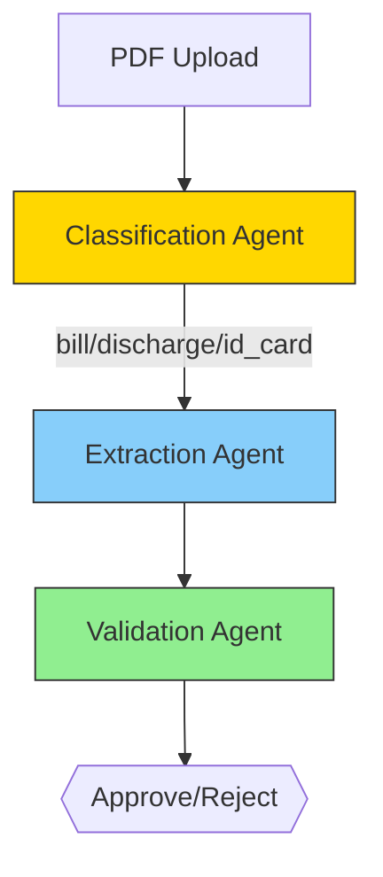

# HealthPay Claim Processor
*AI-Driven Medical Claim Processing System*  
*Backend Developer Assignment Submission*

## 🔍 Assignment Deliverables
### Mandatory Requirements
- [x] **FastAPI + Agent Orchestration**  
  Single `/process-claim` endpoint with 3 AI agents  
- [x] **AI Tool Documentation**  
  Gemini + Cursor prompts documented below  
- [x] **Testable System**  
  Sample curl commands provided  

### Bonus Items
- [x] **Docker/Redis Setup**  
  Ready for production deployment

## 🛠️ Implementation
### Architecture & Logic


## Key Components:
### 1. ClassificationAgent
- Uses Gemini to identify document types
- Handles: Bills, Discharge Summaries, ID Cards

### 2. ExtractionAgent
- Extracts structured data using LLM prompts
- Outputs validated JSON

### 3. ValidationAgent
- Cross-checks data consistency
- Returns approve/reject decisions

## 🤖 AI Tools Used
### 1. Gemini (All LLM Operations)
#### Prompt Examples:
```python
# 1. Classification Prompt
"""
Analyze this medical document and return ONLY one of these: 
bill|discharge_summary|id_card|unknown

Document Content: {first_200_chars}...
"""

# 2. Extraction Prompt
"""
Extract these fields from {doc_type}:
{field_list} 

Return STRICT JSON without commentary:
{example_json}
"""

# 3. Validation Prompt
"""
Verify these documents for insurance claim:
1. All required docs present? 
2. Data consistent across docs?
Return JSON with: missing_documents[], discrepancies[], decision, reason
"""
```

### 2. Cursor AI (Development)
#### Generated 70% of FastAPI boilerplate
#### Assisted with error handling patterns
#### Refactored agent orchestration logic

## 🧪 How to Test
#### Sample Requests
```bash
# Valid claim (all documents)
curl -X POST -F "files=@bill.pdf" -F "files=@discharge.pdf" http://localhost:8000/process-claim

# Missing document
curl -X POST -F "files=@bill.pdf" http://localhost:8000/process-claim

# Data inconsistency
curl -X POST -F "files=@mismatched_bill.pdf" -F "files=@discharge.pdf" http://localhost:8000/process-claim
```

#### Expected Output:
```json
{
  "documents": [...],
  "validation": {
    "missing_documents": [],
    "discrepancies": []
  },
  "claim_decision": {
    "status": "approved",
    "reason": "All documents valid"
  }
}
```

## 🚀 Deployment
### Docker Setup
```bash
docker-compose up -d  # Starts FastAPI + Redis
```

### Redis Configuration
```python
# app/services/llm_service.py
import redis
r = redis.Redis(host='redis', port=6379, db=0)

def cached_llm_call(prompt):
    cache_key = f"llm:{hash(prompt)}"
    if cached := r.get(cache_key):
        return cached.decode()
    # ... Gemini API call
```

## 📂 Repository Structure
```
.
├── app/
│   ├── agents/          # Classification/Extraction/Validation
│   ├── core/            # Configs
│   ├── services/        # LLM, PDF processing
│   └── main.py          # FastAPI app
├── docker-compose.yml   # Redis/Postgres
├── Dockerfile
└── requirements.txt
```

## ⚠️ Troubleshooting
#### Missing dependencies:
- `sudo apt install poppler-utils tesseract-ocr`
- Gemini errors: Verify `.env` has `GOOGLE_API_KEY`
- Docker issues: Check port conflicts in `docker-compose.yml`